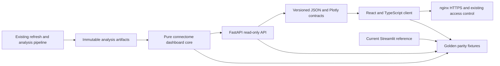

# Connectome Dashboard: FastAPI + React Migration Plan

Status: implementation-complete protected shadow; root cutover not authorized  
Migration rule: preserve the live Streamlit application until every migrated section passes data, statistical, visual, and interaction parity.

## 1. Objective and non-negotiable constraints

The target is a read-only FastAPI backend and React frontend that reproduce the current dashboard without changing:

- cohort membership, subject identifiers, group labels, or source files;
- definitions of graph, DTI, LR/SR, EDR, network, brain-age, delay, coupling, or ML metrics;
- subject-level units of inference, statistical tests, multiplicity corrections, effect sizes, or displayed directions;
- matrix selection, atlas-label mapping, edge filtering, display-only outlier rules, or download contents;
- pipeline-monitor semantics, release gates, or refresh intervals;
- current HTTPS and access restrictions.

The migration is an application-architecture change. It is not permission to recalculate scientific outputs with a different recipe.

## 2. Audited starting point

The current application is a single 18,096-line Streamlit module with:

- 18 analysis sections;
- 426 Python functions;
- 105 `render_*` functions;
- 35 Streamlit data caches;
- CSV, JSON, NIfTI and connectome-matrix reads from the existing analysis and derivatives trees;
- Altair and Plotly figures;
- a 20-second live pipeline monitor;
- nginx HTTPS/basic-auth exposure with Streamlit bound only to localhost;
- a separate refresh process that generates the source analysis artifacts.

The immediate active vertical slice is `LR-SR Analysis`, including tract-length summaries, EDR exception definition and visualization, feature EDA, and subject-level strength inference.

## 3. Target architecture



Ownership is deliberately separated:

- the refresh pipeline owns generated scientific artifacts;
- the pure Python core owns loading, validation, calculation and figure specifications;
- FastAPI owns serialization, request validation, caching headers and read-only delivery;
- React owns layout, controls, tables and rendering;
- neither FastAPI nor React writes to the scientific data tree.

## 4. Proposed repository layout

```text
connectome_dashboard_core/
  config.py
  schemas.py
  data_access.py
  provenance.py
  statistics.py
  figures.py
  sections/
    demographics.py
    dti.py
    graph.py
    matrix_viewer.py
    coupling.py
    brain_age.py
    lr_sr.py
    edr.py
    ml.py
    delay.py
    advanced.py
    networks.py
    pipeline_monitor.py

apps/connectome_api/
  main.py
  dependencies.py
  cache.py
  routers/
  tests/

apps/connectome_web/
  src/
    api/
    components/
    features/
    pages/
    routes/
    theme/
  tests/

tests/dashboard_parity/
  fixtures/
  test_core_against_streamlit.py
  test_api_contracts.py
  test_statistical_parity.py
  test_plotly_parity.py
  test_end_to_end.py
```

The existing `connectome_analysis/` package remains the source for reusable scientific routines. Functions are not duplicated if an authoritative implementation already exists there.

## 5. API contract

All endpoints are versioned under `/api/v1`. Responses include:

- `schema_version`;
- source-artifact paths or stable artifact identifiers;
- source modification times and, for release artifacts, recorded hashes;
- cohort and row counts;
- calculation/configuration identifiers;
- values at full precision, with rounding performed only for display;
- explicit missing-data and warning fields.

Initial route groups:

- `GET /health/live` and `GET /health/ready`
- `GET /metadata/app`
- `GET /metadata/provenance`
- `GET /sections`
- `GET /sections/{section_id}/artifacts`
- `GET /cohort/summary`
- `GET /cohort/demographics`
- `GET /metrics/{family}/catalog`
- `GET /metrics/{family}/subject-values`
- `GET /metrics/{family}/descriptives`
- `GET /metrics/{family}/pairwise`
- `GET /nodes/{family}/rankings`
- `GET /networks/mapping`
- `GET /networks/{family}/summary`
- `GET /connectomes/subjects`
- `GET /connectomes/{subject_id}/{weight}/matrix`
- `GET /connectomes/{subject_id}/{weight}/edges`
- `GET /connectomes/{subject_id}/{weight}/summary`
- `GET /lr-sr/tract-length/summary`
- `GET /lr-sr/tract-length/distribution`
- `GET /lr-sr/exceptions/config`
- `GET /lr-sr/exceptions/summary`
- `GET /lr-sr/exceptions/inference`
- `GET /lr-sr/exceptions/{subject_id}/example`
- `GET /models/features/families`
- `GET /models/features/eda`
- `GET /models/diagnostics`
- `GET /pipeline/release-status`
- `GET /pipeline/live-status`
- `GET /downloads/{artifact_id}`

FastAPI returns authoritative full-precision subject, node, network, model and
statistical tables with source provenance. React performs display-only Plotly
assembly from those contracts; inferential calculations, exception membership,
multiple-comparison correction and source selection remain in the Python core
or in the recorded authoritative artifacts. Visual-only IQR trimming never
changes reported medians or tests.

Subject-level endpoints are protected by the same access boundary as the current raw-table switch. Matrix and table endpoints use allow-listed roots and identifiers; no client-supplied filesystem paths are accepted.

## 6. React application map

The React application preserves all current sections and groups:

- General: Demographics, Novel Findings
- Graph Measures: Global DTI, Local/ROI DTI, Global Graph, Node Metrics
- Functional Measures: Coupling, Coupling-AAL, Delay
- Tractography: SC Matrix Viewer, LR/SR, LR-SR Analysis, EDR Exceptions
- Network Measures: Network Analysis
- Advanced: Brain Age, ML Diagnostics, Advanced, Functional Pending
- Operations: Live Pipeline Monitor

Shared components:

- application shell and grouped section navigation;
- provenance/cohort strip;
- metric selector and definition panel;
- statistically annotated Plotly panel;
- compact data table with explicit units and downloadable source;
- subject, group, atlas, matrix-weight and threshold controls;
- warning/missing-data/error states;
- pipeline status cards, progress bars, lane table and ordered gate tracker.

React Query manages request caching and invalidation. Pipeline status polls every 20 seconds initially, matching current behavior. Server-sent events can replace polling later without changing scientific contracts.

## 7. Migration sequence

### Phase 0 — Freeze and measure the reference

- [x] Record the current section inventory and application size.
- [x] Validate the corrected LR strength analysis in Streamlit.
- [x] Capture golden JSON/table/Plotly fixtures for every section using the current source-artifact snapshot.
- [x] Record every control, default, option list, table, plot, download and warning state.
- [x] Add deterministic fixture metadata: artifact timestamps, cohort counts and implementation hashes.

Exit gate: the current dashboard can be tested as a reference rather than judged manually from screenshots.

### Phase 1 — Extract a pure Python core

- [x] Move configuration and path resolution out of Streamlit.
- [x] Move file reads into allow-listed data-access functions.
- [x] Move calculations and statistical tests used by the migrated interfaces
  into pure functions, while treating stored refresh outputs as authoritative
  where recalculation would be inappropriate.
- [x] Move scientific data preparation into the pure core/API; keep only
  display assembly, labels and visual-only filtering in React.
- [x] Preserve Streamlit unchanged as the rollback reference. Refactoring the
  live monolith into thin wrappers was deliberately not made a cutover
  dependency because it would add risk without changing the migrated result.
- [x] Remove `st.cache_data`, `st.session_state` and UI objects from core functions.
- [x] Add unit tests against frozen reference results for the extracted vertical slice; extend sectionwise with each remaining extraction.

Exit gate: Streamlit still passes its existing smoke test, and extracted functions reproduce every frozen numeric output.

### Phase 2 — Build the FastAPI foundation

- [x] Create Pydantic response schemas and OpenAPI documentation.
- [x] Implement read-only data, statistics, figure and download routers.
- [x] Add bounded in-process caching keyed by source modification time and request parameters.
- [x] Add structured logs, request IDs, health checks and exception mapping.
- [x] Deny filesystem traversal, arbitrary downloads and mutation verbs.
- [x] Add API contract tests; sustained concurrency/load profiling remains part of the pre-cutover gate.

Exit gate: API values match pure-core fixtures exactly or within declared floating-point tolerances.

### Phase 3 — Build the React shell

- [x] Create a TypeScript/Vite React application.
- [x] Reproduce the current dark shell, grouped navigation and compact analysis layout.
- [x] Add generated TypeScript API types from FastAPI OpenAPI.
- [x] Add accessible loading, empty, warning and error states.
- [x] Add Plotly, compact tables and controlled artifact downloads.
- [x] Add Playwright end-to-end route smoke tests covering all 18 analysis
  routes, the overview, LR-SR plots/statistics, matrix viewer and monitor.
- [x] Add an automated WCAG A/AA audit across representative page families;
  retain a human keyboard/screen-reader review as a pre-cutover gate.

Exit gate: the shell can navigate every route and correctly represents unavailable data without inventing content.

### Phase 4 — Migrate the LR-SR vertical slice first

- [x] Tract-length distributions and summary.
- [x] Exception-basis selector and definitions.
- [x] EDR exception summary and subject example plot.
- [x] Subject-level exception/non-exception strength statistics defined without a ratio.
- [x] Four targeted strength contrasts exposed with explicit direction and Holm correction.
- [x] Feature-family overview and feature-level EDA.
- [x] LR/SR source tables, figures and downloads remain accessible through the dedicated and generic routes.

Exit gate: cohort counts, medians, exception membership, tests, adjusted p-values, effect sizes, directions, plots and controls match the Streamlit reference.

### Phase 5 — Migrate remaining analysis sections

- [x] Demographics and provenance.
- [x] Global and local DTI.
- [x] Global graph and node metrics.
- [x] SC matrix viewer.
- [x] Coupling and Coupling-AAL.
- [x] Brain age and delay.
- [x] EDR, advanced structural and network analysis.
- [x] ML diagnostics and novel-findings synthesis.
- [x] Functional-pending state and artifact browser/downloads.

Each section is switched only after its own parity gate passes.

### Phase 6 — Migrate the live pipeline monitor

- [x] Release tracker, processing lanes and ordered gates from canonical JSON/CSV evidence.
- [x] Existing AAL3 monitor and paginated per-subject manifest.
- [x] Host/process telemetry from the existing status artifact without launching shell commands from an HTTP request.
- [x] Keep density recalculation out of the read-only API; any operational trigger remains in the legacy view until separately designed.
- [x] Preserve the 20-second update behavior.

Exit gate: displayed totals reconcile to their canonical ledgers and no endpoint can start or alter scientific processing without an explicit separate authorization design.

### Phase 7 — Shadow deployment and cutover

- [x] Run `connectome-api` on localhost port 8001.
- [x] Serve the React build on `/next/`.
- [x] Keep Streamlit available unchanged at `/`; a separate `/legacy/` alias is unnecessary before cutover.
- [x] Route `/api/` to FastAPI through nginx.
- [x] Reuse current HTTPS/basic auth and restricted security-group policy.
- [x] Run the complete automated numeric, API, route, interaction, overlap,
  accessibility, mobile-width and bounded-load suite. A final human
  visual/keyboard acceptance pass remains the promotion gate.
- [ ] Promote React to `/` only after all gates pass.
- [x] Retain a dated nginx backup and rollback runbook; rehearse removal and
  restoration of the shadow service while verifying Streamlit remains healthy.

## 8. Required parity gates

Every section must pass all applicable gates:

- [x] same source-artifact set and cohort membership;
- [x] same subject and group counts;
- [x] same metric/control options and defaults for migrated interfaces;
- [x] exact integer/count/table/string equality for contract-tested outputs;
- [x] floating values match frozen/recorded outputs before display rounding;
- [x] same statistical unit, test, alternative, effect size and multiplicity family;
- [x] same missing-value, zero and non-positive handling;
- [x] same exception membership for every subject-edge observation;
- [x] same scientific plotted series, category order, labels and annotations,
  with documented display-only outlier and layout improvements;
- [x] same downloadable source bytes or an explicitly named client-generated
  view export;
- [x] same authenticated raw-data visibility policy;
- [x] no new write path to analysis or derivative data;
- [x] no uncaught API, React or browser-console errors.

For the four current targeted LR strength tests, the golden fixture must contain the raw subject-level input columns and recompute:

1. MCI vs AD exception strength;
2. MCI vs AD non-exception strength;
3. MCI vs AD subject-level `exception median − non-exception median`;
4. CN vs AD subject-level `exception median − non-exception median`.

The four raw p-values are Holm-corrected together. Broader omnibus and pairwise exploratory families remain separately labelled so the UI cannot conflate them.

## 9. Testing strategy

- Pure-function unit tests for every calculation.
- Property tests for symmetric matrices, valid node indices, finite edge selections and correction monotonicity.
- Golden tests generated from a locked current artifact snapshot.
- Independent test-side recomputation of key statistical results rather than comparing a function with itself.
- FastAPI schema, status, cache-invalidation, path-safety and concurrency tests.
- React component tests for controls and empty/error states.
- Playwright workflows covering every section and download.
- Visual regression at fixed viewport sizes for layout; scientific values are compared structurally, not inferred from pixels.
- Performance tests for the largest matrix, edge and feature-table responses.

## 10. Deployment and rollback

Proposed services:

- `connectome-api.service`: FastAPI/Uvicorn bound to `127.0.0.1:8001`;
- nginx `/api/` proxy to FastAPI;
- nginx `/next/` static React build during shadow mode;
- existing `connectome-dashboard.service` retained unchanged during migration.

Production cutover changes nginx routing only after validation. The old Streamlit process and config remain available for rollback. No migration phase modifies the analysis refresh loop or active HCP379 production workers.

## 11. Definition of done

Migration is complete only when:

- [x] all 18 analysis sections and the live monitor are available in React;
- [x] automated section-level parity gates pass against the frozen and live
  source contracts;
- [x] a live-snapshot reconciliation passes in shadow mode;
- [x] raw/scientific downloads and access controls are verified;
- [x] the React shadow survives service restart and cache invalidation;
- [x] shadow removal/restoration is rehearsed while the Streamlit reference
  remains healthy;
- [x] the parity report, API schema and deployment runbook are archived.

The implementation is complete in shadow mode. Streamlit remains the
authoritative public root until the user completes the human acceptance pass
and explicitly authorizes promotion.
