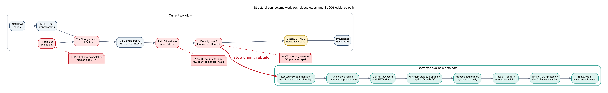
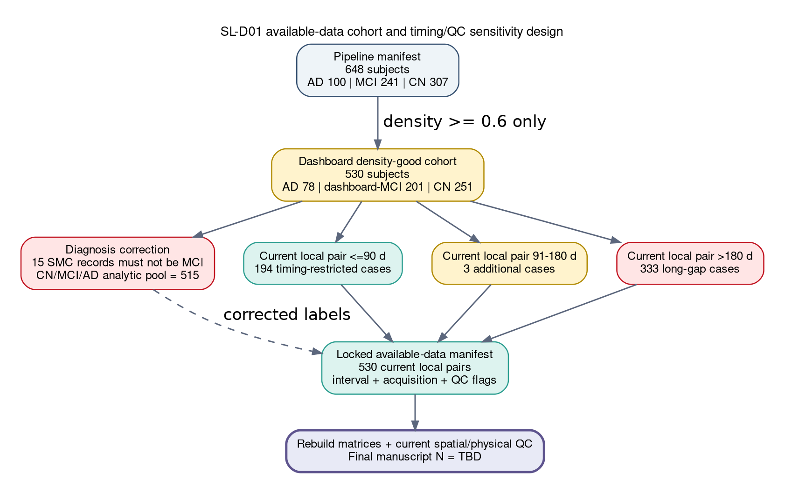

# Objective 1 — decisive structural-connectome audit and corrective-action plan

**Decision date:** 2026-07-18 UTC  
**Project:** `/home/ec2-user/exp`  
**Evidence base:** current code and services, `/data/derivatives`, the June provisional dashboard snapshot, [pipeline and results audit](pipeline_and_results_audit.md), and the reproducible outputs under [`research_audit/outputs`](outputs/).  
**Execution status:** no imaging or tractography rerun was launched; production derivatives and dashboard outputs were not modified. The source-frozen v2.0.11 candidate is preserved as historical implementation evidence but is not compatible with the approved SL-D01 attempt/attrition contract. SL-P0-11–14 are reopened before any canary.

**Implementation update, 2026-07-18 10:30 UTC:** SL-H01, SL-P0-09, SL-P0-10, and design-only SL-H03-C1 are complete. Diagnosis reconciliation resolves all 530 selected DTI IDs. The immutable source lock covers 530 pairs/1,060 series/451,115 unique files/99,066,365,832 bytes with zero duplicate-content groups or source mutations. Fixed-data feasibility independently reproduces the population counts, common-support cells, design ranks, exact ADNI2/GE41 alias, MDEs, and header-only metadata warnings; the complete pre-refactor research-audit suite passes 62/62 tests. SL-P0-11 is active. A deeper contract audit reopened SL-P0-11–14 because v2.0.11 rejects long-gap/SMC rows and cannot publish mixed PASS/FAIL, outcome-specific NA attrition. No imaging canary has run or been authorized.

## Executive verdict

### Decision: **NO-GO for manuscript claims; GO for a corrected rerun**

The current dashboard is a useful exploratory platform, but the 530-subject result set is not a valid locked scientific cohort and no current biological claim should be labeled a confirmed or novel CN/MCI/AD discriminator.

The audit found five causal blockers upstream of the statistics:

1. **Non-contemporaneous anatomy:** the original rounded-age screen found only 197/530 DTI–T1 pairs in the same ADNI phase and within 0.5 years. A subsequent raw-path exact-date audit found 194/530 current pairs within 90 days, 197/530 within 180 days, and 333/530 beyond 180 days.
2. **Wrong matrix semantics:** 477/530 matrices labeled `count` are exactly equal to SIFT2-weighted `fd_sum`. They are not raw streamline counts.
3. **Unreconciled QC and mixed recipes:** density alone selects the 530 rows; 363 retain stale legacy exclusion flags; current outputs mix ACT/noACT, 3M/10M, radial-2/radial-4, and multiple registration/recovery routes.
4. **Diagnosis–acquisition aliasing:** phase, manufacturer, gradient directions, protocol, and site are all strongly associated with diagnosis. The broad adjusted designs are numerically ill-conditioned, while adequately restricted contemporaneous/protocol strata contain only 7–10 AD subjects.
5. **Execution-contract mismatch:** the historical v2.0.11 canary candidate cannot consume the approved 530-row source contract, rejects >180-day and SMC rows, and requires every subject/all nine matrices to PASS before it emits a ledger. It cannot represent the approved attempt-all, mixed terminal-state, outcome-specific failure/NA flow.

The most defensible biological signal to carry forward is therefore a **retest hypothesis**, not a finding: AD shows directionally lower FA and higher MD/RD/AxD than CN in whole-brain and several network summaries, with mapped Limbic MD/RD/AxD remaining a plausible candidate. The current claim that the Limbic network is “the most affected across all four metrics” is false as written and is not robustly established. Visual/Limbic graph efficiency, brain age, NBS, clinical prediction, ML classification, and compensation/mediation are not current headline results.

The available acquisition pairing is now content-locked, its fixed-data estimability has been measured, and design-only SL-H03-C1 is approved. The active work is the versioned SL-P0-11–14 input/DAG/test/ledger refactor; a blinded canary remains separately gated. The corrected results—not the current dashboard cards—must decide the manuscript narrative.

Audit and repair flows:

- [Current pipeline and audit decision flow](figures/pipeline_audit_flow.png) ([SVG](figures/pipeline_audit_flow.svg))
- [Visit-matched cohort repair and rerun flow](figures/cohort_repair_flow.png) ([SVG](figures/cohort_repair_flow.svg))





## 1. Evidence and audit reproducibility

The independent audit was run by `research_audit/audit_analysis.py`, which writes only under `research_audit/outputs` and `research_audit/figures` (`audit_analysis.py:1-10`). Its input paths, SHA-256 hashes, package versions, seed, and generation time are recorded in [audit_run_manifest.json](outputs/audit_run_manifest.json).

Primary audit artifacts:

- [cohort_audit_manifest.csv](outputs/cohort_audit_manifest.csv): 530 rows, 98 audit fields per subject.
- [dti_t1_pairing_summary.csv](outputs/dti_t1_pairing_summary.csv): group-specific pairing intervals and phase mismatches.
- [acquisition_group_association.csv](outputs/acquisition_group_association.csv): Cramér's V and chi-square tests for acquisition factors.
- [sensitivity_stratum_counts.csv](outputs/sensitivity_stratum_counts.csv): exact audit cohort definitions and counts.
- [metric_sensitivity_results.csv](outputs/metric_sensitivity_results.csv): 1,268 omnibus rows across six cohort definitions.
- [metric_pairwise_sensitivity.csv](outputs/metric_pairwise_sensitivity.csv): 3,804 CN/MCI/AD pairwise effect rows.
- [existing_q_vs_permutation_summary.csv](outputs/existing_q_vs_permutation_summary.csv): disagreement between dashboard q-values and its permutation results.
- [feature_missingness_by_group.csv](outputs/feature_missingness_by_group.csv): group-specific availability for 214 features.
- [dashboard_dti_metadata_mismatches.csv](outputs/dashboard_dti_metadata_mismatches.csv): 32 processed-DTI identity mismatches.
- [visit_matched_t1_manifest_dryrun.csv](outputs/visit_matched_t1_manifest_dryrun.csv): metadata-only screen of current T1 retention, candidate replacements, and unresolved cases.
- [visit_matched_t1_manifest_summary.md](outputs/visit_matched_t1_manifest_summary.md) and [summary CSV](outputs/visit_matched_t1_manifest_summary.csv): exact repair counts by action and diagnosis group.
- [catalog_source_inventory.md](catalog_source_inventory.md): live local/S3 source audit and exact-date coverage.
- [current_t1_exact_date_evidence_v2.csv](outputs/current_t1_exact_date_evidence_v2.csv): 530 current DTI–T1 pairs with exact DTI dates and raw-path T1 dates.
- [replacement_t1_catalog_coverage_v2.csv](outputs/replacement_t1_catalog_coverage_v2.csv): source coverage for all 330 proposed replacement IDs.
- [exact_date_t1_candidate_request_v2.csv](outputs/exact_date_t1_candidate_request_v2.csv): frozen 4,015-ID Original T1-like request universe for all 530 subjects, including the 330 provisional replacements as a tagged subset.
- [exact_date_t1_candidate_request_validation_v2.json](outputs/exact_date_t1_candidate_request_validation_v2.json): internally validated roster counts, source hashes, and candidate-definition contract.
- [diagnosis_reconciliation_v2.csv](outputs/diagnosis_reconciliation_v2.csv): 530 exact selected-DTI diagnosis/identity rows, with explicit raw and harmonized groups.
- [dti_identity_mismatch_resolution_v2.csv](outputs/dti_identity_mismatch_resolution_v2.csv): all 32 processed-dashboard to Original-pipeline DTI identity corrections.
- [diagnosis_reconciliation_validation_v2.json](outputs/diagnosis_reconciliation_validation_v2.json): PASS schema/source/output attestation; 0 unknown diagnoses or unresolved identities.
- [available_data_pair_manifest_v2.csv](outputs/available_data_pair_manifest_v2.csv): checksum-bound 530-row SL-D01 input manifest, with exact intervals, uniquely resolved local series, diagnosis, acquisition/QC fields, and limitation flags.
- [available_data_pair_manifest_validation_v2.json](outputs/available_data_pair_manifest_validation_v2.json), [strata](outputs/available_data_pair_strata_v2.csv), and [flow](outputs/available_data_pair_flow_v2.csv): PASS/READY_FOR_HUMAN_POLICY_GATE evidence and exact cohort accounting.
- [available-data content lock](outputs/available_data_content_lock_v2/available_data_content_lock_validation_v2.json): independently verified PASS release for 530 pairs, 1,060 series, 451,115 files, and 99,066,365,832 bytes; zero duplicate-content groups or source mutations.
- [fixed-data feasibility memo](outputs/fixed_data_feasibility_power_memo_v1.md), [validation](outputs/cohort_v2_feasibility_validation.json), and [workflow-contract audit](outputs/cohort_v2_workflow_contract_feasibility.csv): independently verified support, rank, estimability, MDE, header-proxy, and pre-canary blocker evidence; no biological outcomes opened.
- [closed-world design v1.1](closed_world_analysis_design_v1.md), [SL-H03-C1 recommendation](decisions/sl_h03_c1_recommendation_20260718.md), and [approval record](decisions/sl_h03_c1_approval_20260718.md): approved DESIGN-ONLY cohort/estimand basis for SL-P0-11–14 implementation.
- [historical provisional v1 snapshot](snapshots/historical_provisional_v1/summary.md): 6,047 canonical files with SHA-256, environment capture, retention inventory, and read-only S3 reconciliation.
- [audit_statistics_summary.md](outputs/audit_statistics_summary.md): short audit summary and interpretation rule.

The audit is a sensitivity analysis of already generated summaries. It does not repair bad DTI–T1 pairing, regenerate matrices, or replace a confirmatory model on a corrected cohort.

## 2. Exact current state

### 2.1 Pipeline/output snapshot

- Selected pipeline manifest: 648 subjects—AD 100, dashboard-MCI 241, CN 307.
- Density-good main directory: 530—AD 78, dashboard-MCI 201, CN 251.
- Corrected diagnostic audit set: 515—AD 78, MCI/EMCI/LMCI 186, CN 251; 15 SMC subjects are excluded from the CN/MCI/AD definition rather than silently collapsed into MCI.
- Structural matrices: 530 subjects.
- Diffusivity matrices: 529 subjects; `168_S_6938_I1444126` lacks FA, MD, RD, and AxD.
- Current main matrices are 166x166, finite, symmetric, and zero-diagonal.
- Current density range: .60095–.95239; median .74133; mean .74594.
- Analysis snapshot: last full refresh June 17, explicitly `snapshot_mode=provisional`.
- Live dashboard: active behind nginx; no active tractography or refresh job during audit.
- Historical provisional v1 is now hash-frozen. Read-only S3 reconciliation found 4,755/4,779 mapped matrix/cohort files matching, with 12 stale-size and 12 missing matrix objects across three locally reprocessed subjects; no upload was performed.

### 2.2 Matrix validity and semantics

- `count == fd_sum` exactly for 477/530 subjects; those `count` files contain fractional values.
- 190/530 count matrices contain at least one completely zero row; maximum 28.
- 415/529 diffusivity matrices contain at least one zero row; median 8, maximum 164.
- `invlen_mean` has median 54 zero rows; maximum 164.
- FA exceeds 1 in three subjects; maximum 1.19158.
- Negative values occur in five MD, ten RD, and two AxD subjects.
- The recovery builder applies `-tck_weights_in` to every weight, including `count` (`scripts/scforge/live/run_sc_route_sota.py:454-470`).

These are not cosmetic naming issues. They change the scientific meaning and duplicate signal across feature families. Every graph/edge/ML result derived from current `count` must be regenerated after the matrix contract is corrected.

### 2.3 DTI–T1 pairing

The pipeline selects T1 by subject root rather than visit/date (`connectome_pipeline/connectome_step7.py:3320-3368`). The audit defines “contemporaneous” as same phase plus absolute DTI–T1 age gap <=0.5 years (`research_audit/audit_analysis.py:206-218`).

| Corrected group | N | Phase mismatch | Mean gap | Median gap | 90th percentile | Maximum | Contemporaneous | <=2 years |
|---|---:|---:|---:|---:|---:|---:|---:|---:|
| CN | 251 | 94 | 3.32 y | 2.10 y | 8.90 y | 13.8 y | 106 (42.2%) | 121 (48.2%) |
| MCI | 186 | 85 | 3.75 y | 3.20 y | 8.75 y | 12.1 y | 60 (32.3%) | 81 (43.5%) |
| AD | 78 | 3 | 1.09 y | 1.00 y | 2.30 y | 7.9 y | 31 (39.7%) | 62 (79.5%) |
| **All dashboard rows** | **530** | **196** | **3.20 y** | **2.10 y** | **8.41 y** | **13.8 y** | **197 (37.2%)** | **264 (49.8%)** |

The mismatch is differential: AD is much more likely to have a T1 within two years than CN or MCI, while MCI has the largest mean gap. Because T1 drives 5TT, atlas warp, registration, and anatomical constraints, this can directly induce diagnosis-associated technical differences.

#### 2.3.1 Visit-matched T1 repair dry run

The new dry-run manifest converts the pairing audit into an actionable acquisition screen, but it is **not yet an approved visit manifest**. The available `all_mri.csv` metadata contain phase and age rounded to 0.1 years, not exact study dates. Consequently, the screen can identify likely same-visit replacements but cannot prove either the proposed <=90-day primary rule or the <=180-day sensitivity rule.

| Dry-run action | AD | CN | MCI | SMC | Total |
|---|---:|---:|---:|---:|---:|
| Retain current contemporaneous T1 | 31 | 106 | 60 | 0 | **197** |
| Replace after exact-date and image-QC verification | 47 | 142 | 126 | 15 | **330** |
| Exclude or source a closer T1 | 0 | 3 | 0 | 0 | **3** |

None of the 330 provisional replacement candidates are present locally. Under SL-D01 they will not be acquired: the 530 current pairs are the fixed available-data cohort. Their timing mismatch must therefore remain explicit rather than being described as repaired. The 15 SMC subjects remain outside the primary CN/MCI/AD definition unless the human clinical decision changes.

A read-only exact-date source audit subsequently recovered dates for all current pairs: 194 meet the proposed <=90-day primary window, 197 meet the <=180-day sensitivity window, and 333 exceed 180 days. The three 91–180-day cases are all AD (92, 102, and 134 days). Raw-path T1 dates agree with mri_master Study Date for all 57 current images where both sources overlap. This is strong provenance evidence for current files, but final publication manifests should still cite an ADNI export or DICOM StudyDate.

The 330 proposed replacement IDs are all represented in `all_mri.csv`, but 0/330 occur in the exact-date `mri_master.csv` and 0/330 are present in the local raw MRI tree. They are only a nested provisional subset of 4,015 locally known Original T1-like candidates. That audit proves why a replacement route would require new authoritative metadata; it is now retained as contingency/provenance evidence rather than an active dependency. The configured AWS `aml` principal passes verification and the project-known AWS search is negative. No cloud object was changed or downloaded.

### 2.4 Diagnosis and metadata coding

- Fifteen original SMC rows are currently recoded as MCI by the production audit map (`pipeline/audit/subject_manifest.py:22-27`). They must not enter a primary MCI group without an explicit clinical decision.
- The v2 reconciliation now prevents that collapse: exact selected-DTI labels are CN 251, MCI 128, EMCI 39, LMCI 19, AD 78, and SMC 15; explicit harmonization yields CN 251, MCI 186, AD 78, and SMC 15. All 530 resolve at the exact DTI ID/date and all 32 processed-versus-Original identity mismatches are concordant. The remaining limitation is diagnostic provenance: no local longitudinal/biomarker adjudication table was found, so these are supplied ADNI image-catalog `Research Group` labels.
- For 32 subjects, all in AD, the dashboard/master DTI image ID is a processed FA/MD/RD/AxD/Eddy derivative, while the processed pipeline series is the original DTI image ID. Age and phase agree, but the dashboard row is not the authoritative acquisition series and does not carry the correct original protocol identity. All 32 map to GE 3T/41-direction originals in the independent manifest.
- The audit therefore uses the actual DTI image ID parsed from the current series manifest and joins it to `cohort/dti_master.csv` (`audit_analysis.py:106-173`).

### 2.5 Stale QC

The June master table contains 363 `sc_matrix_qc_include=False` rows and only 167 `True` rows. Statuses are:

- FAIL_REGISTRATION 230
- WARN_SPARSE_NODE 104
- FAIL_LABEL_COVERAGE 85
- PASS 63
- FAIL_STREAMLINE_ASSIGNMENT 48

The decision file predates the June recovery. These flags are not proof that all 363 current repaired matrices fail, but their attachment to the current master proves that post-repair QC was never reconciled. The cohort builder retains density >=.6 without filtering the attached gate (`connectome_analysis/analysis_cohort.py:142-165`, `:180-186`). The correct action is to regenerate QC, not to ignore or blindly enforce the May flags.

## 3. Acquisition confounding

The diagnosis-corrected N=515 audit set shows strong acquisition associations:

| Factor | N | Cramér's V | Chi-square p |
|---|---:|---:|---:|
| Gradient directions | 514 | .423 | 2.94e-35 |
| Protocol key | 515 | .421 | 1.15e-32 |
| Site | 515 | .411 | 4.28e-18 |
| DTI phase | 515 | .410 | 3.46e-37 |
| Manufacturer | 515 | .392 | 1.19e-31 |
| Assignment radius | 515 | .000 | .756 |

The absence of group imbalance for radius does not make radius harmless: radial-2 and radial-4 have materially different density distributions. Radius is a technical precision/nuisance factor even though it is not a diagnosis confound in the corrected 515 rows.

Key protocol composition:

- Siemens 3T/54 directions: AD 22, CN 145, MCI 93.
- Siemens 3T/30 directions: AD 7, CN 54, MCI 40.
- GE 3T/41 directions: AD 33, CN 3, MCI 0.
- ADNI phase: AD 33/44/1, CN 3/242/6, MCI 0/180/6 across ADNI 2/3/4.

The ADNI2 GE/41-direction block is almost an AD-only acquisition stratum. A statistical covariate cannot reliably separate diagnosis from protocol when the design has little or no cross-group overlap.

## 4. Statistical audit

### 4.1 Sensitivity cohort definitions

| Stratum | Total | CN | MCI | AD | Sites | Protocols | Role |
|---|---:|---:|---:|---:|---:|---:|---|
| Dashboard all, including SMC-as-MCI | 530 | 251 | 201 | 78 | 52 | 11 | Reproduces dashboard labels; not scientifically preferred |
| Diagnosis-corrected all | 515 | 251 | 186 | 78 | 51 | 10 | Removes SMC from MCI |
| Contemporaneous T1 | 197 | 106 | 60 | 31 | 40 | 8 | Same phase and <=0.5-year gap |
| Siemens 3T/54 directions | 260 | 145 | 93 | 22 | 18 | 1 | Homogeneous protocol, but mixed T1 timing |
| Contemporaneous Siemens 3T/54 | 94 | 57 | 27 | 10 | 17 | 1 | Timing + protocol restriction |
| Contemporary protocol overlap sites | 75 | 42 | 26 | 7 | 11 | 1 | Sites with at least two diagnoses in preceding stratum |
| Above + legacy QC include + radial-2 | 23 | 14 | 8 | 1 | 7 | 1 | Not estimable; legacy QC is stale |

The smallest valid overlap strata are underpowered, especially for AD. Their null FDR results do not prove that no biological effect exists. They prove that the current dataset cannot distinguish a robust effect from protocol/timing/QC without a corrected rerun or more overlap data.

### 4.2 Number of audited discoveries by stratum

BH correction was applied across every audited feature within each stratum. The adjusted model is an HC3 rank-ANCOVA with the covariates named in the output (`audit_analysis.py:444-493`).

| Stratum | Features tested | KW q<.05 | Adjusted q<.05 | Finite adjusted tests | Median condition number |
|---|---:|---:|---:|---:|---:|
| Dashboard all | 214 | 109 | 54 | 212 | 9.69e18 |
| Diagnosis-corrected all | 214 | 104 | 46 | 206 | 3.22e18 |
| Contemporaneous T1 | 214 | 49 | 0 | 142 | 4.58e18 |
| Siemens 3T/54 | 214 | 59 | 64 | 214 | 1.30e3 |
| Contemporaneous Siemens 3T/54 | 210 | 0 | 0 | 200 | 1.24e3 |
| Contemporary protocol-overlap sites | 202 | 0 | 0 | 197 | 8.75e2 |

The full-cohort adjusted models are too ill-conditioned for confident inference. The homogeneous models are numerically better, but the combined timing/protocol strata are too small to survive correction. There is no current stratum that is simultaneously large, well-overlapped, contemporaneous, homogeneous, and fully QC-valid.

### 4.3 Existing dashboard q-values versus its permutation test

The current network layer already contains major internal disagreement:

| Mapping/family | Tests | q<.05 | Permutation p<.05 | q-significant but permutation-null |
|---|---:|---:|---:|---:|
| Functional connectivity | 55 | 1 | 4 | 1 |
| Functional coupling | 40 | 0 | 1 | 0 |
| Functional graph | 30 | 7 | 6 | 6 |
| Functional microstructure | 40 | 40 | 10 | 30 |
| Anatomical connectivity | 45 | 0 | 4 | 0 |
| Anatomical coupling | 36 | 3 | 8 | 0 |
| Anatomical graph | 27 | 8 | 3 | 8 |
| Anatomical microstructure | 36 | 36 | 11 | 25 |

The permutation implementation itself permutes group labels with covariates fixed rather than using a validated residual-permutation scheme (`connectome_analysis/analysis_stats.py:195-235`). It is diagnostic, not a final confirmatory test.

### 4.4 Key AD-versus-CN effects across restrictions

Cliff's delta below is AD minus CN. Negative FA means lower FA in AD; positive MD/RD/AxD means higher diffusivity in AD. Pairwise q is corrected across all audited features for that contrast and stratum.

| Candidate | Corrected all delta/q | Contemporaneous delta/q | Siemens-54 delta/q | Contemporary Siemens-54 delta/q | Protocol-overlap delta/q |
|---|---:|---:|---:|---:|---:|
| Whole-brain FA | -.499 / 1.20e-9 | -.407 / .021 | -.338 / .041 | -.404 / .167 | -.204 / .638 |
| Whole-brain MD | +.500 / 1.20e-9 | +.430 / .021 | +.517 / .002 | +.637 / .059 | +.456 / .361 |
| Whole-brain AxD | +.463 / 1.13e-8 | +.387 / .023 | +.500 / .002 | +.544 / .060 | +.374 / .376 |
| Whole-brain RD | +.512 / 1.20e-9 | +.413 / .021 | +.488 / .002 | +.602 / .059 | +.422 / .361 |
| Limbic MD | +.539 / 1.13e-8 | +.398 / .033 | +.547 / .002 | +.703 / .059 | +.627 / .361 |
| Limbic RD | +.518 / 3.53e-8 | +.391 / .036 | +.488 / .005 | +.669 / .059 | +.600 / .361 |
| Limbic AxD | +.554 / 5.22e-9 | +.367 / .041 | +.544 / .002 | +.546 / .075 | +.492 / .361 |
| Limbic FA | -.359 / 1.39e-4 | -.298 / .123 | -.278 / .156 | -.451 / .167 | -.381 / .376 |
| DMN FA | -.512 / 1.20e-9 | -.435 / .021 | -.359 / .030 | -.487 / .081 | -.300 / .505 |
| Visual nodal efficiency | -.274 / 8.05e-4 | -.184 / .298 | +.070 / .890 | -.039 / .971 | -.177 / .692 |
| Limbic nodal efficiency | -.242 / .003 | -.119 / .492 | -.033 / .929 | +.105 / .932 | -.170 / .705 |
| Frontal nodal-efficiency–FA coupling | -.403 / 8e-6 | -.257 / .150 | -.357 / .035 | -.453 / .120 | -.236 / .593 |

Interpretation:

- Microstructure directions remain broadly consistent, and Limbic MD/RD/AxD effect sizes remain moderate to large in the small homogeneous strata. This justifies a retest hypothesis.
- No AD–CN feature is FDR-significant in every diagnosis-corrected, contemporaneous, protocol-homogeneous, and overlap-site stratum.
- The Limbic network is not strongest for all metrics. In the protocol-overlap subset it ranks first for mapped functional MD/RD, fourth for AxD, and second for FA; in the contemporaneous subset it ranks fifth for MD, fourth for RD, third for AxD, and sixth for FA.
- Visual and Limbic graph effects shrink, reverse, or vanish under protocol restriction; they are not robust current findings.
- Frontal topology–microstructure coupling is directionally suggestive but not multiplicity-stable in contemporaneous/overlap cohorts.

### 4.5 Missingness and selection

Graph summaries are present for all corrected subjects, but microstructure and topology–microstructure coupling are differentially missing. Examples include approximately 55% missingness in AD for thalamic coupling versus 9–14% in CN/MCI, and approximately 68% missingness in AD for functional Frontoparietal coupling versus about 23% in CN/MCI. This can change both effect estimates and network rankings.

The density >=.6 inclusion rule also conditions on a technical outcome related to registration, endpoint assignment, anatomy, and possibly diagnosis. Final analysis must report attempted-versus-included characteristics and perform threshold/selection sensitivity.

## 5. Claim-by-claim triage

`RETAIN` means the statement can remain as a verified descriptive fact. `REFRAME` means it may remain only as a clearly labeled hypothesis/candidate. `DROP` means remove it from the current abstract, title, highlights, and main conclusion.

| Current or proposed claim | Decision | Required treatment |
|---|---|---|
| The pipeline currently exposes 530 dense 166-node structural matrices | **RETAIN** | Technical snapshot only. State that the corrected CN/MCI/AD audit set is 515 after excluding 15 SMC and that current QC is provisional. |
| FA/MD/RD/AxD contain group-discriminating signal | **REFRAME** | “Directionally consistent multimetric microstructure candidate.” Do not call it novel; established DTI literature already reports lower FA/higher diffusivity in AD/MCI. |
| The mapped Limbic network is the most affected network across all four metrics | **DROP** | False as a universal rank and exposed to mapping, timing, protocol, and missingness. Replace with “mapped Limbic MD/RD/AxD is a candidate for corrected retesting.” |
| Limbic AxD/MD/RD is elevated in AD | **REFRAME** | Effect direction persists across restrictions, but contemporaneous/protocol subsets have only 7–10 AD and no FDR-stable result. Retest after corrected local-data reconstruction, with interval/protocol/QC sensitivities. |
| Limbic/DMN FA is reduced in AD | **REFRAME** | DMN FA is the stronger current FA candidate. Neither is confirmed under the smallest overlap strata. |
| Visual and Limbic structural efficiency/strength are reduced in AD | **DROP** | Visual effect reverses toward zero in Siemens-54; Limbic effect disappears. Do not use as a main story. |
| Frontal structure-function coupling is reduced in AD | **DROP** | No fMRI/function measure exists. The term is scientifically wrong. |
| Frontal graph–DTI/topology–microstructure coupling is lower in AD | **REFRAME** | Directionally interesting, but not FDR-stable in contemporaneous/overlap strata and heavily missing in AD. Secondary retest only. |
| Subcortical age effects are general aging and distinct from AD-specific Limbic effects | **DROP** | Cross-sectional pooled age association plus a null interaction does not establish equal slopes or biological separation. Requires a prespecified longitudinal/interaction model. |
| Current NBS identifies an AD network component | **DROP** | No component reaches p<.05; closest CN–AD p=.0547, using only 200 permutations and an NBS-like implementation. |
| Brain age distinguishes groups | **DROP** | Overall R2=.0095, MAE=6.70 years, adjusted BAG p=.10. |
| Structural ML differentiates CN/MCI/AD | **REFRAME** | Exploratory benchmark only: best balanced accuracy .505, macro-AUROC .676. Random folds can learn acquisition/site. Not a paper contribution. |
| Structural features predict MMSE or CDR | **DROP** | Primary MMSE N=62, best R2 about .033; CDR N=65, best accuracy about .40. Targets are too sparse and loosely scan-aligned. |
| Limbic/DMN paths mediate disease or show compensation | **DROP** | Cross-sectional, seven selected chains, no multiplicity correction, and one 115% proportion. No causal/compensation language. |
| Exploratory indirect associations exist in four of seven chains | **REFRAME** | Supplement only, labeled non-causal; rerun after correction and adjust across prespecified chains. |
| LR/SR or raw short-range > long-range weight is a disease signature | **DROP** | Raw length dependence is expected; only distance-adjusted, prespecified group effects could be considered. |
| Earlier thalamic–limbic/cingulate dashboard story is current | **DROP** | It belongs to superseded matrix/cohort generations and was not revalidated under the present audit family. |
| A generic DTI/connectome CN/MCI/AD distinction is novel | **DROP** | The literature evidence map contains 108 verified prior-art/guardrail records; 84 are established prior art and 21 methodological prior art. |
| A specific corrected, timing-audited multimetric network ranking may be novel | **REFRAME** | This is a future hypothesis only. Novelty requires corrected available-data results plus a protocol-driven systematic search at the exact claim granularity. |

## 6. Objective 1 conclusion

### Findings that survive only as retest candidates

1. Whole-brain AD-versus-CN FA/MD/RD/AxD directions are consistent in the current restricted subsets.
2. Mapped Limbic MD/RD/AxD remains a plausible localized candidate, particularly MD/RD, but not a proven four-metric rank.
3. DMN FA may be a stronger FA candidate than mapped Limbic FA.
4. Frontal topology–microstructure coupling may be explored secondarily if missingness and matrix semantics are fixed.

### Findings that should not drive the paper

Visual/Limbic graph efficiency, current NBS, brain age, ML, clinical prediction, mediation/compensation, generic age separation, LR/SR tangents, and older thalamic narratives should not be used to force a coherent story. They are null, weak, mislabeled, confounded, or superseded.

### Missing pieces that require new computation

Yes—corrective work is mandatory. Under SL-D01 the pipeline must be rerun from the existing local DTI/T1 pairs with corrected matrix semantics and a single prespecified recipe. Acquisition interval cannot be repaired, so it becomes an explicit limitation and sensitivity axis. This is not a statistics-only repair.

---

# Separate executable corrective-action plan

## 7. Dependency graph

```text
P0.0 freeze snapshot
  -> P0.1 metadata-screened acquisition/diagnosis manifest
      -> SL-D01 available-data manifest + timing/QC sensitivity design
          -> P0.2 feasibility + power + primary cohort decision
              -> P0.3 corrected workflow/recipe/matrix contract
                  -> P0.4 balanced canary -> HUMAN CANARY GATE
                      -> P0.5 full corrected processing
                          -> P0.6 current QC + cohort lock
                              -> P0.8 primary/sensitivity analysis
      -> P0.7 statistical analysis plan --------------------^
P0.8 -> P1 validation/reproducibility -> P2 novelty/replication/manuscript
```

Do **not** launch `run_sc_route_sota.py` cohort-wide as the corrective rerun. Its current count semantics are wrong, and its keep-best registration choice optimizes density. Implement and canary the corrected workflow first.

## 8. P0 — gates and fixed constraints before biological inference

### P0.0 Freeze the current provisional snapshot

- **Dependencies:** none.
- **Current status:** complete with an explicit S3 warning. The non-destructive snapshot froze 6,047 canonical files, including all 4,766 current matrices, 965 June-analysis files, the 648-row manifest, code/configuration, cohort metadata, and the audit package. All required checks passed. The 40.0 GB noncanonical repair tier is inventory-only pending a human retention decision.
- **Action:** hash the 648 manifest, all 530 matrix sets, cohort files, analysis outputs, code revision/tree state, dashboard refresh metadata, and environment versions. Mark it `historical_provisional_v1`; make no claim that it is final.
- **Expected outputs:** `research_audit/snapshots/historical_provisional_v1/manifest.json`, SHA-256 inventory, storage/S3 reconciliation report.
- **Acceptance:** every referenced file has path, size, mtime, hash; no duplicate subject/series key; local versus S3 status is explicit.
- **Compute:** low; approximately 1–3 hours of disk-bound hashing for multi-terabyte sources, much less if only canonical artifacts are hashed first.
- **Human decision:** retention tier for large legacy tracks and whether to perform a full live S3 checksum audit.

### P0.1 Build the locked available-data acquisition and diagnosis manifest

- **Dependencies:** P0.0.
- **Current status:** DONE. Exact local-file dates exist for all 530 current pairs: 194 are within 90 days, 197 within 180 days, and 333 exceed 180 days. These are fixed available pairs under SL-D01, not a visit-matched cohort. SL-H01 approved all 530 technical attempts/attrition rows, the 515 CN/MCI/AD contrast ceiling, separate SMC, low-quality-valid retention, hard-invalid-to-NA, and required sensitivities.
- **Action:** join current DTI/T1 IDs, dates, local paths/hashes, diagnosis at DTI date, site, scanner/model, field strength, gradients, protocol, cross-phase status, interval, quantitative QC, and processing availability. Preserve every current pair and label timing/QC strata without silently promoting invalid outputs.
- **Expected outputs:** `available_data_pair_manifest_v2.csv`, diagnosis reconciliation, timing/QC/protocol sensitivity flags, participant flow, and immutable hashes.
- **Acceptance:** one deterministic row per chosen DTI series; all 530 current pair IDs/dates/paths retained; no unresolved duplicates; SMC not silently treated as MCI; 32 DTI identity mismatches resolved or explicitly unknown; mathematically invalid downstream outputs remain failures.
- **Compute:** low; existing metadata are sufficient to proceed.
- **Resolved decisions:** all 530 selected local pairs are attempted regardless of interval; 515 CN/MCI/AD rows are the pre-QC diagnostic ceiling; 15 SMC rows are processed/accounted and reported separately; diagnosis is checksum-bound to the exact selected DTI ID/date; timing is modeled/restricted in sensitivities rather than used to discard available source rows.

### P0.1a External replacement acquisition — superseded

SL-D01 explicitly retires external catalog recovery, replacement-object inventory, and image transfer from the active plan. The 4,015-ID roster, source audit, validator, and deterministic pairing implementation are preserved as a reproducible contingency if the user later reopens data acquisition. No external image is currently requested or authorized.

### P0.2 Feasibility, overlap, and power gate

- **Dependencies:** locked P0.1 available-data manifest.
- **Current status:** DONE and independently verified. Aggregate exploratory modeling is feasible with a parsimonious design; CN–MCI has the best measured common support, while AD contrasts have limited cell depth. The phase-plus-protocol and site-fixed stress designs are rank-deficient; ADNI 2 exactly aliases GE 3 T/41 directions. No exact timing×site×protocol×T1 cell has at least five subjects in each diagnosis.
- **Action completed:** quantified N by group, phase, site, protocol, T1 source, and timing; calculated conservative planning MDE/attrition stress; enumerated estimable/non-estimable contrasts; audited the manifest-to-workflow contract without opening biological outcomes.
- **Expected outputs:** `cohort_v2_feasibility.csv`, overlap plots, exclusion flow, power/simulation memo.
- **Acceptance:** quantify which diagnosis effects are estimable in the fixed dataset. If acquisition is near-aliased with diagnosis, narrow the estimand and manuscript claim rather than implying that additional matched data will be acquired.
- **Validation:** 7/7 focused and 62/62 full research-audit tests PASS; independent counts/ranks/support/MDE/header audit and every input/output hash match. Validation SHA-256 is `4fd319a3edc2897552a4f9e1415bbf95b06dc42bbfa9b1816850311940e6cdde`.
- **Human decision:** SL-H03-C1 was approved at 10:28 UTC. The frozen design uses all 530 technical attempts; a 515 CN/MCI/AD outcome-specific ceiling; 15 SMC separate; primary supported-edge whole-brain FA; parsimonious protocol + T1-source adjustment; support-calibrated contrasts and mandatory timing/acquisition/QC/missingness sensitivities. This approval does not authorize imaging.

### P0.3 Implement one corrected workflow, recipe, and matrix contract

- **Dependencies:** SL-H03-C1 is approved for design/code/tests; actual imaging remains separately gated.
- **Current status:** REOPENED as SL-P0-11–14. The historical `connectome-v2.0.11-canary-candidate` has a useful validated core recipe/nine-matrix contract, but its input layer, DAG terminal-state behavior, integration tests, and provenance/run ledger do not implement SL-H01. It rejects >180-day rows and SMC, requires visit-matched Original T1 and an absent normalized manifest, and constrains `fail=0`/`excluded=0`.
- **Historical work retained:** the candidate executable DAG eliminated result-driven route selection, fixed raw `count`, and specified ACT/iFOD2/10M/SIFT2/radial-4, response/FOD, BBR+ANTs registration, AAL3, tensor/QC semantics, and DTI-UID-derived RNG. These components remain evidence, not authorization to run v2.0.11.
- **Required corrective action:** issue a new recipe/source projection that accepts all 530 technical attempts, normalizes locked raw-DICOM/single-NIfTI inputs, never fabricates missing UID/phase-encoding/readout values, allows independent subjects to PASS/PARTIAL/FAIL, and publishes outcome-specific validity/NA plus complete attrition even when failures occur.
- **Required matrix definitions:**
  - `count`: raw integer streamline count, no `-tck_weights_in`.
  - `fd_sum`: SIFT2-weight sum.
  - `count_invnodevol`: explicitly derived from raw count, or renamed if SIFT2-weighted.
  - length and DTI weights: units and absent-edge behavior fixed.
- **Expected outputs:** executable `scforge/workflow/Snakefile` and rules, `configs/connectome_v2.yaml`, environment/container lock, unit/integration tests, matrix data dictionary.
- **New acceptance required:** preserve the core matrix/scientific checks, update YAML/Snakefile/dictionary/provenance/ledger/launcher/source locks, test long-gap/processed-T1/SMC admission and mixed terminal states, and pass a 530-row SL-D01 schema/dry run before P0.4. Historical 47/47, 173/173, 44/44, and 54-job results do not satisfy this new contract by themselves.
- **Human decisions:**
  1. ACT versus noACT. Recommended: decide from blinded anatomical canaries, not density; if noACT is necessary, justify it and make it the single primary route.
  2. Streamline target—3M versus 10M. Recommended: benchmark convergence before committing to 10M.
  3. Assignment radius—choose one value for all primary subjects.
  4. Primary atlas/network mapping—recommend anatomical AAL3 systems primary; approximate Yeo mapping secondary.

### P0.4 Run a balanced blinded canary

- **Dependencies:** design-only SL-H03-C1 plus revised/refrozen SL-P0-11–14 and their 530-row dry run. H03 does not itself authorize imaging execution.
- **Action:** choose 12–24 subjects balanced across CN/MCI/AD, protocol/site, anisotropy, atrophy, and prior failure types. Process from raw inputs through all nine matrices and QC. Review registration, 5TT/FOD, atlas labels, endpoint overlays, and tensor maps without seeing diagnosis where feasible.
- **Planned command contract:** use `scforge/workflow/run_connectome_v2.py` with the SL-H01/SL-H03-approved manifest, dedicated `scforge_v2` run root, blinded human-QC manifest and approved core count. Direct ad hoc Snakemake launch is not the attested route.
- **Expected outputs:** canary matrices, full provenance sidecars, quantitative QC table, blinded overlays, runtime/storage benchmark, canary decision memo.
- **Acceptance:** selected canary rows and source hashes match the locked all-local manifest; interval/T1 source are preserved as design strata rather than hidden exclusions; count is integer and distinct from fd_sum; 166 labels are handled under a prespecified policy; no unexplained zero count nodes; FA/diffusivity ranges valid; registration and endpoint QC thresholds are fixed diagnosis-blind; every PASS/PARTIAL/FAIL state appears in the attrition ledger; no recipe change is chosen because it improves disease separation.
- **Compute:** moderate. At 5–8 GB per 10M tractogram, 12–24 canaries need roughly 60–200 GB just for tracks plus scratch. Expected wall time is hours to about one day on the current host, to be replaced by measured canary benchmarks.
- **Human gate:** imaging expert approves or rejects canary overlays and thresholds. Do not scale automatically.

### P0.5 Full corrected processing

- **Dependencies:** P0.4 human approval.
- **Action:** attempt the approved recipe on all 530 locked local pairs with immutable per-subject provenance, checkpointed QC, and explicit terminal-state/attrition capture. Do not restrict source execution by diagnosis, interval, or T1 source class.
- **Expected outputs:** versioned `derivatives/connectome_v2/` tree, nine corrected matrix families, logs, sidecars, run ledger, failure table.
- **Acceptance:** no silent fallback to another recipe; no subject promoted by density alone; input/output hashes complete; every failure classified; matrices pass automated invariants.
- **Compute:** high. A 10M route implies approximately 2.5–4 TB of track files for about 500 subjects before ancillary scratch; budget 3–6 TB transient storage. Full conversion/registration/FOD/tractography will take longer than the prior approximately one-day reassignment-only estimate for 349 subjects. Plan several wall-clock days on the current 64-vCPU, disk-bound host and benchmark before committing.
- **Human decision:** compute/storage budget, concurrency, and track-retention policy after the canary benchmark. SL-H01 has already fixed all 530 as technical attempts; analysis populations remain outcome-specific.

### P0.6 Regenerate QC and lock the analysis cohort

- **Dependencies:** P0.5.
- **Action:** run current spatial, tensor, assignment, and matrix QC against v2 outputs; perform blinded visual sampling and dual review for failures/edge cases; apply one frozen gate.
- **Expected outputs:** `qc_decisions_v2.csv`, `analysis_cohort_v2.csv`, inclusion-probability/attrition tables, QC figures, signed lock manifest with hashes.
- **Acceptance:** no stale May status; one decision per series; required matrices and provenance complete; physical ranges valid; all exclusions have reasons; group/site/protocol attrition reported; primary cohort immutable after lock.
- **Compute:** moderate, several hours to 1–2 days including human visual review.
- **Human decisions:** quantitative QC thresholds, number of blinded visual reviews, adjudication rule, and whether any zero-node allowlist is anatomically justified.

### P0.7 Freeze the statistical analysis plan before seeing v2 group results

- **Dependencies:** P0.2; complete before P0.8 and preferably before P0.5 finishes.
- **Action:** preregister the primary hypothesis family, contrasts, estimand, covariates, missingness policy, permutation/exchangeability design, correction scope, and sensitivity hierarchy.
- **Recommended primary family:** one participant-level whole-brain FA summary—the unweighted upper-triangle mean of corrected `fa_mean` where `count>0`—with CN–MCI, MCI–AD, and CN–AD contrasts. Whole-brain MD/RD/AxD and anatomical/mapped Limbic/DMN candidates are internal-retest tiers; graph/coupling is secondary.
- **Expected outputs:** `research_audit/SAP_v2.md` and machine-readable analysis config.
- **Acceptance:** CN–MCI, MCI–AD, and CN–AD defined; effect sizes/CIs mandatory; acquisition/site/recipe/pair interval handled; correction family fixed; stopping/revision rules explicit.
- **Compute:** low; 1–3 expert days.
- **Human decisions:** primary biological question, primary network definition, acceptable multiplicity family, and whether MCI staging is a primary or secondary objective.

### P0.8 Run prespecified exploratory available-data and sensitivity analyses

- **Dependencies:** P0.6 locked cohort and P0.7 frozen SAP.
- **Action:** run well-conditioned multilevel/robust models and valid residual or block permutations; produce full-cohort continuous-gap, <=90, <=180, protocol/Siemens-54/site overlap, T1-source, QC/missingness/influence, aggregation, and atlas sensitivity tables. These same 530 previously inspected subjects cannot become an independent confirmation through prespecification alone.
- **Expected outputs:** versioned manuscript tables, effect plots, model diagnostics, null-result appendix, immutable section-status manifest.
- **Acceptance:** primary effects retain direction and material magnitude; q/CI meet SAP criteria; condition numbers and overlap diagnostics acceptable; no result depends on one acquisition block or one mapping; nulls retained.
- **Compute:** low to moderate for network/global models—hours. Edgewise NBS is P1 and separate.
- **Human gate:** choose the paper story only after reviewing the locked results; do not promote a result because it resembles the current dashboard narrative.

### P0.9 Release a versioned dashboard snapshot

- **Dependencies:** P0.8.
- **Action:** point a new dashboard release at an immutable v2 analysis root. Keep live operations/QC freshness separate from inference-snapshot freshness.
- **Expected outputs:** dashboard release manifest, visible data version/date, cohort/QC flow, corrected terminology.
- **Acceptance:** no “tract count” for SIFT2 data; AxD not “AD”; topology–microstructure not structure–function; provisional banner remains unless all manuscript gates pass.
- **Compute:** low.
- **Human decision:** publication-facing versus internal-QA access mode.

## 9. P1 — validation and secondary analyses

| ID | Action | Dependencies | Expected output | Acceptance | Compute |
|---|---|---|---|---|---|
| P1.1 | Workflow/container reproducibility replay on a clean canary | P0.3–P0.6 | clean-room build report | hashes and QC agree within declared tolerance | hours–1 day |
| P1.2 | Selection-bias and missingness analysis | P0.6 | included/excluded comparison, threshold sensitivity, IPW if defensible | conclusions not driven by density/QC conditioning | hours |
| P1.3 | Atlas/network-map sensitivity | P0.8 | anatomical AAL3, validated overlap-based Yeo crosswalk, Schaefer/alternate atlas comparison | primary direction stable or mapping dependence explicitly reported | 1–3 days; may require connectome rebuilding |
| P1.4 | Canonical covariate-aware NBS/TFNBS | P0.8 | edge/component tables with 5,000–10,000 permutations | family-wise corrected p and stable components; no current p=.0547 carryover | roughly 6–24 hours after optimization |
| P1.5 | Grouped diagnostic ML | P0.6, SAP extension | site/phase/scanner-held-out nested CV, calibration, CIs | all transforms/harmonization inside folds; external/temporal holdout before headline | hours–days |
| P1.6 | Clinical outcome modeling | visit-aligned clinical labels | MMSE/CDR models with tight time windows | adequate N, ordinal CDR method, positive held-out value over baseline | hours; data work may dominate |
| P1.7 | Exploratory EDR/LR-SR/coupling/indirect associations | P0.8 | supplementary results with declared correction families | supports primary chain without causal overstatement | hours–days |

Human decisions for P1: external/temporal validation split, preferred alternative atlas, acceptable clinical timing window, and which secondary analyses merit compute after primary results are known.

## 10. P2 — novelty, replication, and manuscript

### P2.1 Protocol-driven systematic/scoping review

- **Dependencies:** exact corrected claim from P0.8.
- **Action:** search multiple bibliographic databases with fixed query strings/dates; deduplicate; dual-screen; record inclusion/exclusion; build exact claim-to-prior-art table.
- **Expected outputs:** PRISMA flow, search appendix, screened evidence table, direct support/contradiction map.
- **Acceptance:** every gap claim specifies modality, atlas, metric, network, disease stage, direction, covariates, and validation design; absence claims are supported by the screened corpus, not keyword retrieval alone.
- **Compute:** low computationally; high expert time, approximately 2–6 weeks depending review breadth.
- **Human decision:** systematic review versus narrower scoping review and target journal scope.

### P2.2 Independent replication

- **Dependencies:** P0.8 primary claim and compatible external data.
- **Action:** reproduce the locked workflow/estimand in an untouched external or temporally separated cohort.
- **Expected outputs:** replication cohort flow, effect estimates/CIs, heterogeneity analysis.
- **Acceptance:** same direction, clinically/materially compatible effect, and no tuning on replication labels.
- **Compute:** potentially high imaging compute; depends on external data availability.
- **Human decision:** replication dataset, data-use authorization, and whether an internal-only paper is acceptable if external replication is unavailable.

### P2.3 Manuscript V-final

- **Dependencies:** P0 gates, selected P1 validation, P2.1, and preferably P2.2.
- **Action:** write one coherent chain: acquisition/QC -> multimetric microstructure -> structural topology context -> cautious clinical interpretation. Keep ML, NBS, EDR, and indirect association secondary unless independently validated.
- **Acceptance:** every number regenerates from the locked manifest; nulls and attrition reported; terminology correct; novelty statement matches prior-art evidence; no causal claim from cross-sectional data.
- **Human decision:** target journal, primary emphasis, authorship, and whether to wait for replication.

## 11. Current implementation gate

**SL-H03-C1 — DESIGN ONLY is approved.** It freezes the 530-attempt/515-CN-MCI-AD/15-SMC roles, supported-edge primary FA summary, parsimonious acquisition representation, support-calibrated contrast roles, and required sensitivities. SL-P0-11–14 implementation is authorized; a canary, full imaging run, result unblinding, dashboard inference, and novelty/manuscript claim are not.

The next human authorization will be requested only after the revised recipe, source projection, tests, ledgers, dry run, and blinded canary manifest are ready. Later gates cover canary execution/visual QC, final QC thresholds, SAP/hypothesis family, full-run compute/storage/retention, and replication/journal/claim strength.

## Final Objective 1 decision

Objective 1 finds that corrective actions are not optional. The current pipeline outputs cannot support a final manuscript because matrix meaning, QC, mixed recipes, acquisition overlap, and DTI–T1 timing remain unresolved in the provisional results. Diagnosis identity, the 530-pair source manifest, exact content lock, fixed-data feasibility, and the SL-H03-C1 design basis are now resolved and independently verified or explicitly approved. The historical workflow candidate is not canary-ready under SL-H01, so SL-P0-11–14 are explicitly reopened rather than treated as cosmetic edits. Under SL-D01, all 530 local pairs remain technical attempts/attrition rows; the 515-person CN/MCI/AD contrast ceiling is outcome-specific; SMC remains separate; claims must survive timing/protocol/T1-source/QC/missingness sensitivities. The active work is implementation/refreeze, not imaging execution.

The audit does identify a rational starting hypothesis for the corrected run: **multimetric white-matter microstructure, with mapped Limbic MD/RD/AxD and DMN/whole-brain FA as candidates**. That hypothesis is biologically plausible and directionally consistent, but it is neither confirmed nor generically novel. The current Visual/Limbic graph, brain-age, NBS, ML, prediction, and mediation stories should be removed from the headline and allowed back only if they pass the corrected locked analysis.
